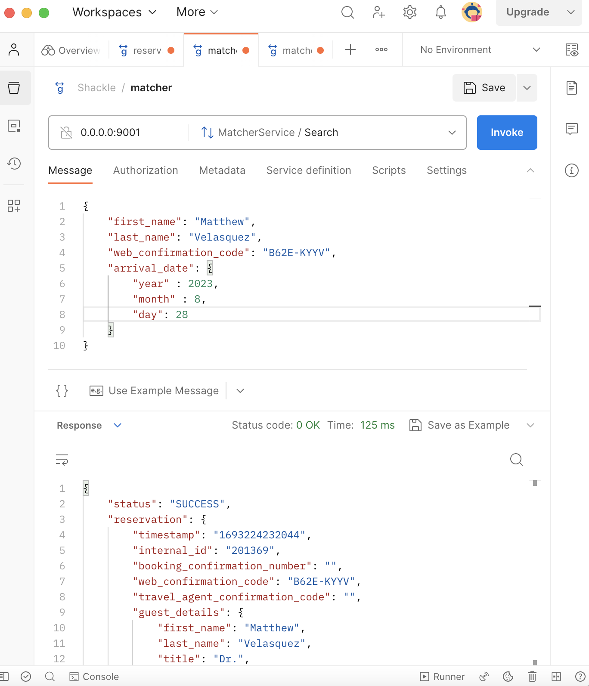

# Reservation Matcher

This an implementation of the Shackle exercise described in [EXERCISE.md](EXERCISE.md)

## Usage

You will first need to install the Quarkus Command Line Interface, you can read on installation instructions 
[here](https://quarkus.io/guides/cli-tooling).

To build the application and generate the gRPC client stub and server base, and run tests, run the command:
```shell
quarkus build
```

To run the application in dev mode, run the command:
```shell
quarkus dev
```

This will start the gRPC application on port 9001. To change this port you can change the configuration properties found
in [src/main/resources/application.properties](src/main/resources/application.properties). For more info on what gRPC
configuration is available, refer to the
[Quarkus documentation](https://quarkus.io/guides/grpc-service-implementation#server-configuration).

You can test your application is running by calling your application using either:
1. [grpcurl](https://github.com/fullstorydev/grpcurl) by running the command
```shell
grpcurl -d 'search_params' -plaintext 127.0.0.1:9001 shackle.matcher.MatcherService.Search
```

But replace `search_params` with correct params, like:
```
{
    "first_name": "Kimberly",
    "last_name": "Johnson",
    "web_confirmation_code": "ZA2C-F3HZ",
    "arrival_date": {
        "year" : 2023,
        "month" : 8,
        "day": 29
    }
}
```

2. [postman](https://learning.postman.com/docs/sending-requests/grpc/grpc-client-overview/) using the address `127.0.0.1:9001`.

Should look something like this:


If you update your proto files and want to regenerate your Kotlin/Java build code, you might want to run the clean
command before rebuilding to clean up any left over generated code.

```shell
./gradlew clean
```

## Notes

I considered git hygiene / PRs / code review out-of-scope for this exercise,
but here is the todo list that I followed:

- [x] scope / explore reservation grpc client for data
- [x] in-memory storage
- [x] grpc client on app startup
- [x] implement a basic api for matcher search
- [x] make happy path work on all the pieces - start with web code only
- [x] on search, implement all 3 confirmation codes check
- [x] on search handle empty list / not found
- [x] handle case where search returns multiple reservations
- [x] handle abbreviated names
- [x] document my protobuff better
- [x] test grpc client
- [x] remove test-only flag
- [x] cleanup

> Disclaimer: Please bear in mind I have no previous experience with Kotlin, Quarkus, gRPC or protobuff.
> The code implemented here was based off of quickly learning these over a few hours.

This means, I was unsure on certain things, like how to best organise the code package-wise
Also, I tried my best to write good quality code but it's unlikely I wrote very idiomatic Kotlin code.

## Solution Overview

I tried to:
- keep it simple, not reinvent the wheel
- lean into the provided scaffold structure/stack/tech

The overall idea is:
- On startup, the app starts reading the reservations stream in the background
- This loads each reservation in-memory, in a way that can be accessed by the rest of the app
- Provided a grpc client `matcher` for performing the search
  - this client reads the in-memory storage and tries to match with the search parameters
- There is success/error handling and returning of the correct results to the search

## Matcher algorithm

I've tried to make a sensible guess on what fields could be used there based off my experience in flights

I've made as few field as possible required, but no less than that:
- Guest first name
- Guest last name
- Arrival date

Also, one of the three confirmation code fields must be present:
- Webcode or BookingCode or AgentCode

When these are not present, we return `REQUEST_MISSING_INFORMATION` status in the response.

I've included handling the case where First Name is abbreviated to one letter, e.g. `Franklin` as `F.`.
This works properly.

There are certainly ways to improve this.
First of all, no detail is returned on `REQUEST_MISSING_INFORMATION`, definitely hinting what the issue is would be welcome.
With that done, we could:
- allow search by different fields other than the name
  - then if we find the reservation we ask for more information, in order to have what's needed to confirm
- improve names handling
  - There are other issues that could happen with names. Some people have multiple surnames for example, and might have used only one of them.
    - Even worse, some providers could just truncate on a certain length or simply drop one of the multiple surnames.
  - Similarly, there are things like middle names or composite first name which can cause confusion as well

## Testing

I tried to test the main pieces of work:
- reservations grpc client
- matcher grpc server
- reservations repo (in-memory storage)

In general, I tried to minimize duplication of tests, and make tests actually test unique things.
I tried isolating the tests to the correct abstraction level and granularity.
So for example, I implemented a mock grpc reservations server to be able to test the reservation grpc client without having to actually run/call the docker service in the tests.

## Reasoning

- I thought about using the same protobuf definition `reservation_service.proto` in the search
    - I actually did this to prototype and get up and running quickly
    - decided against it to decouple reservation-matcher from the third party reservations service
    - our api contract should not be tied to third party service contract
    - We have just 1 reservations service currently, but imagined multiple in the future, which would further complicate things
  - This allowed me to do a small optimization of swapping GuestDetails field numbers to the 1-15 range on protobuff, which uses 1 byte instead of the 2 bytes used in the 16 through 2047 range
- Stored the reservations transformed to internal type "normalized" MatcherReservation
    - to decouple (as much as possible) internal representations from external contracts/types
    - to decouple third party implementation/dependency from search request parameters/types
- I took test examples from the docker service to recreate reliable production data in tests
- In-memory storage choice: a singleton Kotlin MutableList
  - I debated using a in-memory database for this such as H2, I saw there are ways to use it with kotlin/quarkus
  - however, ultimately decided agaisnt it for the sake of time.
- Improvement implemented: test the reservations `ReservationsGrpcClient` / removing it from tests
    - Initially struggled to test the reservations grpc client, but eventually figured out how to do do it
    - Meanwhile though, I implemented a flag to disable it from tests, like so:

```kotlin
import io.quarkus.runtime.StartupEvent
import jakarta.enterprise.context.ApplicationScoped
import jakarta.enterprise.event.Observes
import jakarta.inject.Inject
import org.eclipse.microprofile.config.inject.ConfigProperty

@ApplicationScoped
class AppLifecycleBean {

    @Inject
    lateinit var reservationsGrpcService: ReservationsGrpcClient

    @ConfigProperty(name = "quarkus.grpc.clients.reservation-service.enabled")
    var grpcReservationsClientEnabled: Boolean = false

    fun onStart(@Observes ev: StartupEvent?) {
        if(grpcReservationsClientEnabled) {
            reservationsGrpcService.consumeStream()
        }
    }
}
```
While also adding the following lines to the `application.properties`

```properties
quarkus.grpc.clients.reservation-service.enabled=true
%test.quarkus.grpc.clients.reservation-service.enabled=false
```
However, upon implementing the `MockReservationsGrpcServer`, this was no longer needed, so I removed it.

## Other Improvements
- could use some improvement in the missing information response tipping the user on what's wrong/ which field is missing
- My Matcher protobuff documentation could use some improvement as better descriptions
- ReservationsRepoTest limited test, could add more tests cases
    - perhaps at least 1 test case with the different confirmation codes: booking and agent code tests missing
- Improvement: @BeforeEach to @BeforeAll on MatcherGrpcServiceTest
    - I struggled to make @BeforeAll work, so I used @BeforeEach without really needing it
    - Running once before all tests would have been enough, and it would be faster to run the test suite
    - however it still ran in ~250ms so I didn't think it was a big deal and decided to leave it
- Property-based testing: Given the seemlingly unchanging nature of the data, we could attempt to implement some property-based test to cover lots of edge cases and make the tests more reliable
  - cons: no easy integration with Quarkus, would need manual work/setup or an additional test framework.

## Production-ready TODOs

- I considered out-of-scope for this exercise, but would definitely have done it in a real scenario
    - CI
        - compile
        - test
        - code lint / format check
        - static analysis if available
    - CD
        - build app
        - deploy
    - git higiene / PRs / code review
    - test coverage tracking setup like codecov or coveralls
    - monitoring
      - api uptime
        - could perhaps use this which Quarkus gives us for free https://quarkus.io/guides/grpc-service-implementation#health
      - error monitoring with something like Sentry
    - logs
      - a centralized logs strategy is always welcome to debug / investigate
    - metrics
      - would perhaps be nice to have something like Prometheus